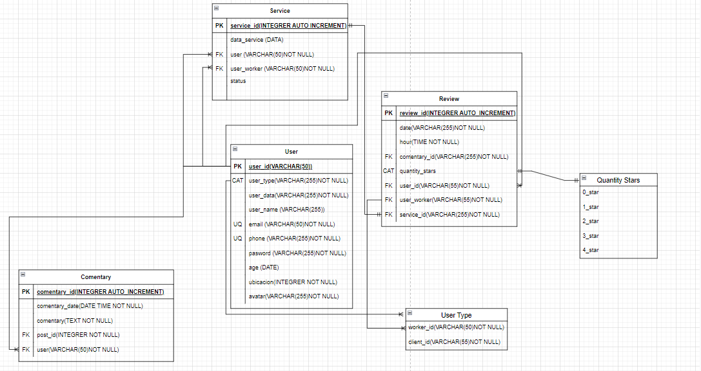

## Modelo Entidad-Relacion
---

### -Entidades
1. Usuario.
2. Servicio.
3. Reseña. 

### -Relaciones
- Usuario pide Servicio 1-M.
- Usuario acepta Servicio 1-M.
- Usuario hace Reseña 1-M. 
- Usuario recibe Reseña 1-M.
- Usuario escribe Comentario 1-M.
- Usuario recibe Comentario 1-M.

### -Atributos

#### Usuario
- user_id (PK)
- tipo_user
- user_data
- user_name
- email (UQ)
- phone(UQ)
- pasword
- age (CAT)
- ubicacion 

### Servicio 
- id_servicio (PK)
- data_servicio
- tipo_servicio
- user (FK)
- user_worker (FK)
- status

### Reseña
- id (PK)
- fecha
- hora
- comentario
- cantidad_estrellas (CAT)
- id_emisor
- id_receptor

### Catalogos

 ## 2. cant_estrellas

- ⭐
- ⭐⭐
- ⭐⭐⭐
- ⭐⭐⭐⭐
- ⭐⭐⭐⭐⭐

### Modelo Relacional

